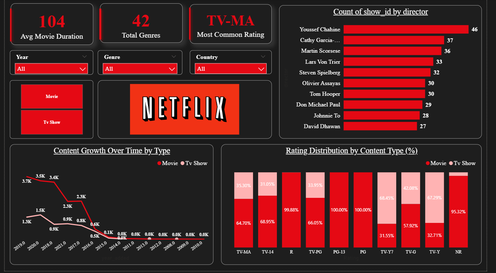
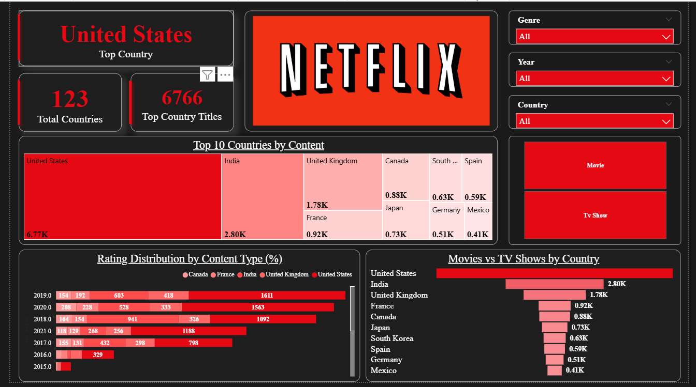
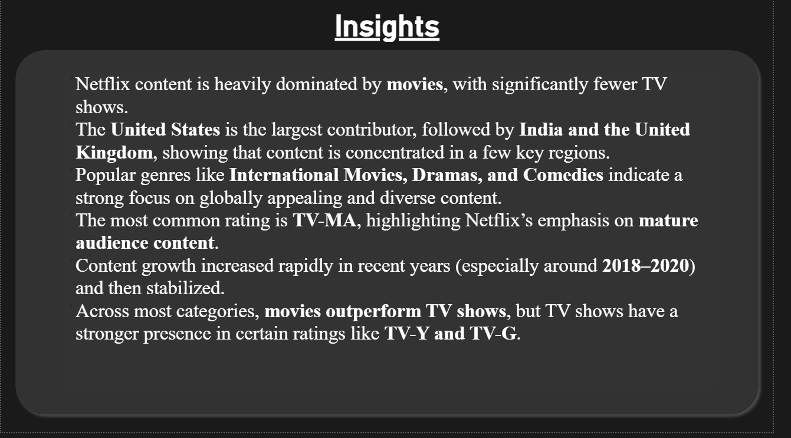

# 📊 Netflix Content Strategy Analyzer (Power BI)

---

## 📌 Overview

This project is a **Power BI dashboard** built to analyze Netflix content and uncover key insights related to genres, ratings, countries, and content trends.

The dashboard helps understand how Netflix distributes content globally and what patterns exist in its content strategy.

---

## 📊 Dashboard Preview

### 🔹 Overview & Key Metrics

---

### 🔹 Trends & Ratings Analysis

---

### 🔹 Country-wise Insights

---

### 🔹 Conclusion

---

## 📈 Key Insights

* Netflix content is heavily dominated by **Movies**, with fewer TV Shows.
* The **United States** is the largest contributor, followed by India and the UK.
* Popular genres include **International Movies, Drama, and Comedy**.
* The most common rating is **TV-MA**, indicating a focus on mature content.
* Content growth increased rapidly around **2018–2020**, then stabilized.
* Movies outperform TV shows across most categories, but TV shows dominate in specific ratings like **TV-Y and TV-G**.

---

## 🛠️ Tools & Technologies

* Power BI
* Data Cleaning & Transformation
* Data Visualization

---

## 📂 Files Included

* `Netflix_dashboard.pbix` → Main Power BI dashboard file

---

